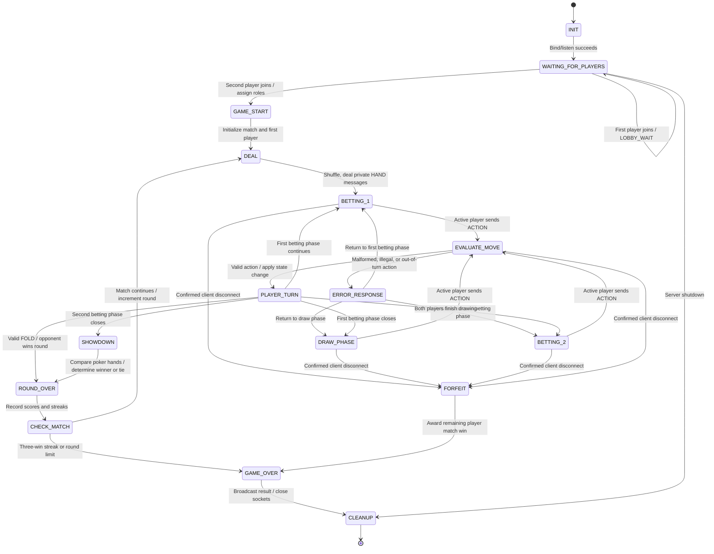

# CS457 Sprint 1 — Game State Machine (FSM) Specification

## 1. Scope

This document specifies the **target server-side finite state machine** for a two-player Five-Card Draw Poker match. The server controls transitions and rejects illegal moves. The current prototype does not yet enforce every betting/draw transition shown below; the diagram is the planned design for implementation.

## 2. State diagram

The following is native Mermaid `stateDiagram-v2` source intended to render directly on GitHub.

**Implementation detail:** `PLAYER_TURN` and `EVALUATE_MOVE` are logical processing states. The concrete implementation may represent the current betting/draw phase as a separate variable; it must still enforce equivalent transition guards.

## 3. State responsibilities

| State | Server behavior | Exit trigger |
|---|---|---|
| `INIT` | Create socket, game object, synchronization primitives | Server begins listening |
| `WAITING_FOR_PLAYERS` | Accept up to two sockets, assign `Player_1` and `Player_2`, send `LOBBY_WAIT` | Two players connected |
| `GAME_START` | Initialize match, announce player roles, maximum rounds and first player | Initialization complete |
| `DEAL` | Create/shuffle deck, deal five unique cards to each player, send private `HAND` | Cards delivered |
| `BETTING_1` | Accept legal first-round betting actions from active player | Betting round closes or fold |
| `DRAW_PHASE` | Allow each player one draw of 0–5 indexed cards | Both players complete draw |
| `BETTING_2` | Accept legal final-round betting actions | Betting round closes or fold |
| `PLAYER_TURN` | Select next actor or next phase after valid move | Phase-dependent transition |
| `EVALUATE_MOVE` | Validate schema, socket identity, turn, phase, action-specific conditions | Valid move or `ERROR` |
| `ERROR_RESPONSE` | Send error to offending client; do not mutate game | Resume same phase |
| `SHOWDOWN` | Evaluate both hands and compare rank/tie-break tuples | Outcome determined |
| `ROUND_OVER` | Announce winner/tie and update wins/streaks | Round results recorded |
| `CHECK_MATCH` | Test three consecutive wins or 10-round limit | Continue or end |
| `FORFEIT` | Resolve confirmed player departure during active match | Award opponent victory |
| `GAME_OVER` | Announce match winner/draw and reason | Final message attempted |
| `CLEANUP` | Close sockets, remove players, release resources | Shutdown complete |

## 4. Action guards and transitions

### Common rules

- Only the socket assigned to `active_player` may submit an `ACTION`.
- `CHECK`, `BET`, `CALL`, and `FOLD` are betting actions; `DRAW` is permitted only in `DRAW_PHASE`.
- `DRAW` may be performed at most once per player per round. Track `draw_completed` per player.
- Invalid JSON, invalid indexes, unknown actions, and out-of-turn actions generate `ERROR` and preserve the current phase, active player, hands, and scores.
- `FOLD` during a legal betting turn immediately awards the round to the opponent, then enters `ROUND_OVER`.

### Planned betting-round rules

- Track current bet, each player's contribution, and which players have acted since the last bet. These fields are **not yet fully implemented** in the prototype.
- `CHECK` is valid only when no amount is owed. Two checks (with no intervening bet) close the betting phase.
- `BET(amount)` is valid only when betting is open and the amount is a positive integer; it creates an outstanding amount to call or fold against.
- `CALL` is valid only when an outstanding bet exists. When the bet is matched, close the betting phase.
- This design omits `RAISE` unless explicitly added to both protocol and FSM; clients must not offer an unsupported raise action.
- Closing `BETTING_1` enters `DRAW_PHASE`. Closing `BETTING_2` enters `SHOWDOWN`.

### Draw rules

- A draw request includes distinct card positions 0–4; an empty list means keep all cards.
- The server draws replacements from the remaining shuffled deck and sends an updated `HAND` only to the requesting player.
- After both players have drawn once, transition to `BETTING_2`.

## 5. Match rules

- At `SHOWDOWN`, compare standard five-card poker hand rankings and kickers. Equal tuples yield a tied round.
- A round win increments that player's consecutive-win streak and resets the opponent's streak. A tie resets both streaks under the current design.
- **Match victory:** first player to win three consecutive rounds.
- **Round limit:** after 10 rounds without a three-win streak, end the match as a draw.
- **Custom first-player rule (planned):** initially each player has a 50% chance to act first; after a player wins a round, reduce that player's chance of acting first next round by 10 percentage points. The implementation must define whether this is a fixed 40/60 split or accumulates across wins before coding it; the prototype has not finalized this behavior.

## 6. Disconnects, errors, and lifecycle

- **Intentional quit:** `DISCONNECT` message followed by TCP close; during a match, transition to `FORFEIT` and then `GAME_OVER`.
- **Graceful TCP close:** `recv()` returns `b''`; stop the receive loop and process the same departure transition.
- **Abrupt failure:** catch `ConnectionResetError`, `BrokenPipeError`, `ConnectionAbortedError`, and relevant timeouts. Network drops may require timeout/keepalive before confirmation.
- **Before match starts:** remove disconnected waiting player; keep or reset lobby as appropriate.
- **After match ends:** reject or ignore gameplay actions, close sockets, and enter `CLEANUP`.
- **Concurrency:** validate and mutate state under a lock; make disconnect/forfeit processing idempotent to avoid duplicate results.

## 7. Transition examples

| Current state | Event | Result |
|---|---|---|
| `WAITING_FOR_PLAYERS` | Second player connects | `GAME_START` |
| `BETTING_1` | Active player checks; other player also checks | `DRAW_PHASE` |
| `BETTING_1` | Active player bets; opponent calls | `DRAW_PHASE` |
| `DRAW_PHASE` | First player's valid draw | Same phase, next player |
| `DRAW_PHASE` | Second player's valid draw | `BETTING_2` |
| `BETTING_2` | Betting closes | `SHOWDOWN` |
| Any active phase | Out-of-turn action | `ERROR`, unchanged state |
| Any active phase | Invalid draw index | `ERROR`, unchanged state |
| Any active phase | Player disconnect confirmed | `FORFEIT` → `GAME_OVER` |
| `CHECK_MATCH` | Streak reaches 3 | `GAME_OVER` |
| `CHECK_MATCH` | Round 10 ends without streak | `GAME_OVER` as draw |

## 8. Implementation alignment

The existing code already models much of the game lifecycle, player turns, poker hands, round results, and disconnects. However, repeated-draw prevention, complete betting rules, and strict phase transitions are still outstanding. This file describes the **intended FSM**, not a claim that every transition currently passes an integration test.
